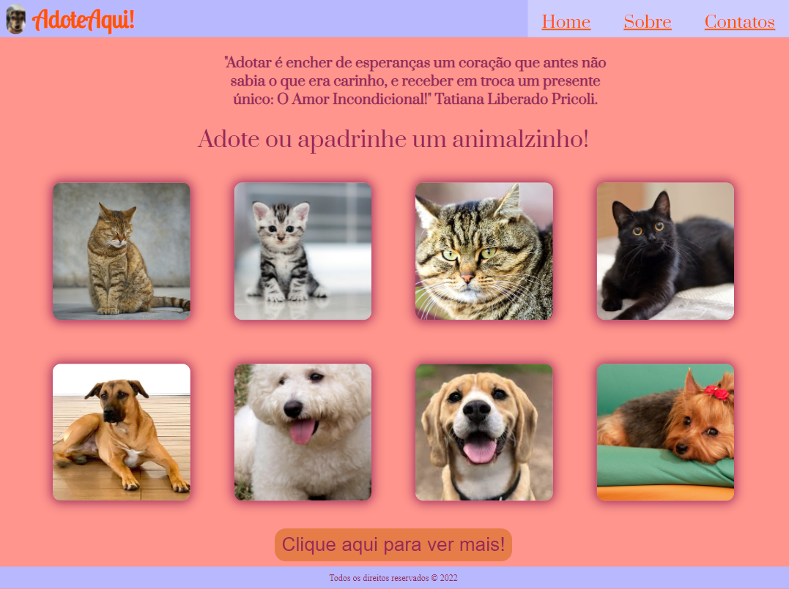

AdoteAqui

  <a href="#resumo">Resumo</a>&nbsp;&nbsp;
  <a href="#autor">Autora</a> 
  

 

<h2 id="resumo"> Resumo do projeto </h2>
  
 Com flexbox, media query e transições, realizei essa página inicial de uma ong de adoção. Um projeto simples, mas significativo para por em prática o aprendizado.
 

  
  **Criado e desenvolvido por [Jiulie Vitória](https://www.linkedin.com/in/jiulie-vitoria/).**
